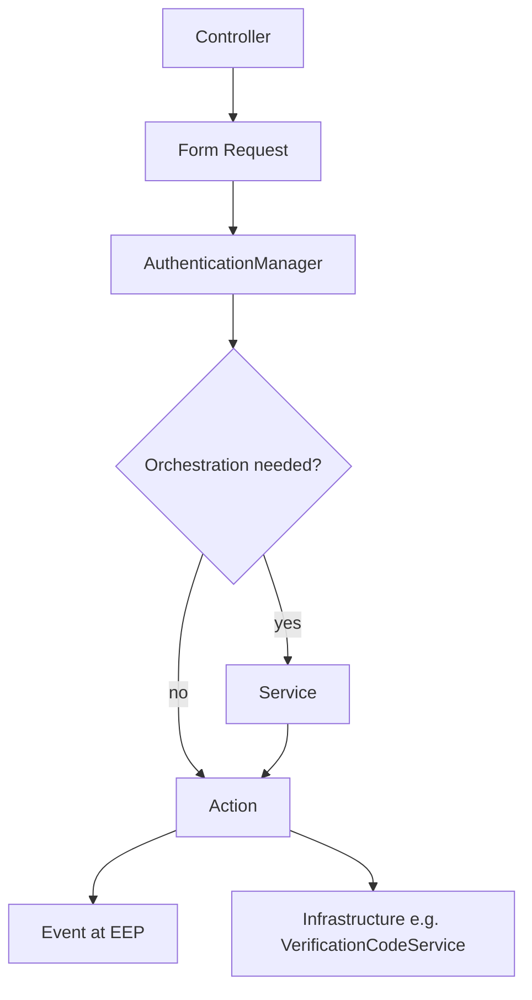

# Authentication Module Architecture (v1.0)

This document describes the **current** Authentication module structure: request flow, layer responsibilities, Actions, domain events, and the API request/response layer.

## Request flow

Every authenticated operation follows the same top-level path. Business events are emitted only from Actions (the Event Emission Point), not from Controllers, Services, or the Manager.

```
HTTP Request
    ↓
Controller          (HTTP only: status codes, redirects/views, exception → response mapping)
    ↓
Form Request        (validation + input preparation)
    ↓
AuthenticationManager   (DTO creation + delegation)
    ↓
Service             (workflow orchestration — when a multi-step flow exists)
    ↓
Action              (single business operation; may call infrastructure services)
    ↓
Event               (domain events at EEP — payload DTOs, no Eloquent models)
```



**Facade boundary:** Host code and controllers call `Authentication::…()` (resolved to `AuthenticationManager`). The Manager is the only place that converts request arrays into typed DTOs before delegating inward.

---

## AuthenticationManager

**Location:** `app/AuthenticationManager.php`  
**Facade:** `Modules\Authentication\Facades\Authentication`

### Responsibilities

- Accept validated arrays from controllers.
- Create DTOs at the facade boundary (`LoginData`, `RegisterUserData`, `PasswordResetRequestData`, `ResetPasswordData`, `EmailVerificationData`).
- Delegate to a **Service** (multi-step workflows) or directly to an **Action** (single-step operations).
- Resolve the current user via `user()` for `me` and similar endpoints.

### Does not

- Implement business rules.
- Dispatch domain events.
- Perform persistence (repositories, Identity writes, OTP storage).
- Own validation (Form Requests) or response shaping (API Resources).

### Delegation map

| Manager method | Delegates to |
|----------------|--------------|
| `login` | `LoginService` |
| `register` | `RegistrationService` |
| `sendPasswordReset`, `resetPassword`, `verifyPasswordResetOtp`, `getEmailForToken` | `PasswordResetService` |
| `sendEmailVerification`, `verifyEmail` | `EmailVerificationService` |
| `verifyLoginOtp`, `resendLoginOtp` | `VerifyLoginOtpAction`, `ResendLoginOtpAction` |
| `logout` | `LogoutUserAction` |
| `sendVerificationCode`, `resendVerificationCode` | `SendVerificationCode`, `ResendVerificationCode` |
| `verifyCode` | `VerifyEmailVerificationCodeAction` |
| `verifyRegistrationOtp`, `resendRegistrationOtp` | `VerifyRegistrationOtpAction`, `ResendRegistrationOtpAction` |
| `setRegistrationPassword`, `skipRegistrationPassword` | `SetRegistrationPasswordAction`, `SkipRegistrationPasswordAction` |

---

## Services

Services coordinate **workflow only**: which Actions run, and in what order. They return result arrays to the Manager; they do not emit domain events.

Supporting classes under `app/Services/` that are **not** workflow orchestrators (used by Actions or middleware) include:

- `VerificationCodeService` — OTP infrastructure (storage, delivery, cooldown/rate limits)
- `FailedLoginService` — lockout tracking
- `TokenService` — API token issue/revoke
- `RegistrationFollowUpService` — post-OTP registration state (grants, next steps)

### Workflow services

| Service | Role |
|---------|------|
| `LoginService` | Routes password login vs OTP initiation; runs post-login verification send after password success. |
| `RegistrationService` | Runs register → OTP init → grant issue → registration verification send. |
| `PasswordResetService` | Routes link vs OTP for send/reset; delegates OTP verify to Action. |
| `EmailVerificationService` | Routes code vs legacy link for send; link verify for `verifyEmail`. |

### Service rules

- **May** call multiple Actions in sequence.
- **May** call read-only helpers (`RegistrationFollowUpService`, resolvers).
- **Must not** dispatch the seven payload-DTO domain events listed below.
- **Must not** own persistence or business rules beyond orchestration.

---

## Actions

Actions own **one business operation**: credential checks, Identity updates, grant consumption, token issue, and **domain event emission** (EEP).

### Login

| Action | Purpose | Domain event |
|--------|---------|--------------|
| `LoginUserAction` | Email/phone + password authentication, session login, API token issue | `UserLoggedIn` |
| `InitiateLoginOtpAction` | Start email/phone OTP login (send code) | — (see migration notes) |
| `VerifyLoginOtpAction` | Verify login OTP, session login, API token issue | `UserLoggedIn` |
| `ResendLoginOtpAction` | Resend login OTP | — |
| `SendLoginVerificationCodeAction` | After password login, send email verification code if needed | — |

### Registration

| Action | Purpose | Domain event |
|--------|---------|--------------|
| `RegisterUserAction` | Create or reuse unverified user via Identity | `UserRegistered` (new users only) |
| `InitializeOtpRegistrationAction` | Mark OTP registration follow-up state | — |
| `IssueRegistrationGrantAction` | Create registration grant token | — |
| `SendRegistrationVerificationCodeAction` | Send registration verification OTP | — |
| `VerifyRegistrationOtpAction` | Verify registration OTP, issue verified grant | `EmailVerified` (email channel only) |
| `ResendRegistrationOtpAction` | Resend registration OTP | — |
| `SetRegistrationPasswordAction` | Set password after OTP registration | — |
| `SkipRegistrationPasswordAction` | Skip optional password step | — |
| `ResolveRegistrationCompletionUserAction` | Resolve user from grant for password completion | — |

### Password reset

| Action | Purpose | Domain event |
|--------|---------|--------------|
| `SendPasswordResetLinkAction` | Send reset link (uniform response) | `PasswordResetRequested` |
| `SendPasswordResetOtpAction` | Send reset OTP | `PasswordResetRequested` |
| `VerifyPasswordResetOtpAction` | Verify reset OTP, issue reset grant | — |
| `ResetPasswordWithLinkAction` | Complete reset via link token | `PasswordResetCompleted` |
| `ResetPasswordWithOtpAction` | Complete reset via OTP grant | `PasswordResetCompleted` |
| `ResolvePasswordResetEmailForTokenAction` | Resolve email for token-only reset URLs | — |

### Email verification

| Action | Purpose | Domain event |
|--------|---------|--------------|
| `SendEmailVerificationCodeAction` | Send post-login verification code | `EmailVerificationSent` |
| `SendEmailVerificationLinkAction` | Send legacy verification link | `EmailVerificationSent` |
| `VerifyEmailVerificationCodeAction` | Verify code (authenticated flow) | `EmailVerified` |
| `VerifyEmailVerificationLinkAction` | Verify signed link | `EmailVerified` (+ Laravel `Verified` when newly verified) |
| `SendVerificationCode` | Thin delegate to `VerificationCodeService::sendCode` | — |
| `ResendVerificationCode` | Thin delegate to `VerificationCodeService::resendCode` | — |
| `VerifyCode` | Thin delegate to `VerificationCodeService::verifyCode` | — |

### Logout

| Action | Purpose | Domain event |
|--------|---------|--------------|
| `LogoutUserAction` | Revoke current API token | `UserLoggedOut` |

---

## Event architecture

### Event Emission Point (EEP)

Domain events are dispatched **only from Actions** at the point the business fact is committed (user registered, logged in, verified, etc.).

- **Not** from Controllers, Form Requests, API Resources, `AuthenticationManager`, or workflow Services.
- **Not** from `VerificationCodeService` for the seven domain events below (see migration notes).

Listeners that need a full user model load it via Identity using `payload->userId` (for example `SendWelcomeEmail` on `UserRegistered`).

### Payload DTO events

These events use readonly payload DTOs under `app/DTOs/Events/`. Events expose `public readonly …Payload $payload` and do **not** carry Eloquent models.

Shared field extraction lives in `app/Support/AuthenticationEventSubject.php` (`userId`, `email`, `phone`, `occurredAt`).

| Event | Payload | Emitted from |
|-------|---------|--------------|
| `UserRegistered` | `UserRegisteredPayload` | `RegisterUserAction` |
| `UserLoggedIn` | `UserLoggedInPayload` | `LoginUserAction`, `VerifyLoginOtpAction` |
| `UserLoggedOut` | `UserLoggedOutPayload` | `LogoutUserAction` |
| `PasswordResetRequested` | `PasswordResetRequestedPayload` | `SendPasswordResetLinkAction`, `SendPasswordResetOtpAction` |
| `PasswordResetCompleted` | `PasswordResetCompletedPayload` | `ResetPasswordWithLinkAction`, `ResetPasswordWithOtpAction` |
| `EmailVerificationSent` | `EmailVerificationSentPayload` | `SendEmailVerificationCodeAction`, `SendEmailVerificationLinkAction` |
| `EmailVerified` | `EmailVerifiedPayload` | `VerifyEmailVerificationCodeAction`, `VerifyRegistrationOtpAction` (email channel), `VerifyEmailVerificationLinkAction` |

### Payload fields (summary)

| Payload | Fields |
|---------|--------|
| `UserRegisteredPayload` | `userId`, `email`, `authMethod`, `source`, `occurredAt` |
| `UserLoggedInPayload` | `userId`, `email`, `authMethod`, `source`, `occurredAt` |
| `UserLoggedOutPayload` | `userId`, `email`, `source`, `occurredAt` |
| `PasswordResetRequestedPayload` | `identifier`, `source`, `occurredAt` |
| `PasswordResetCompletedPayload` | `userId`, `email`, `phone`, `source`, `occurredAt` |
| `EmailVerificationSentPayload` | `identifier`, `source`, `occurredAt` |
| `EmailVerifiedPayload` | `userId`, `email`, `source`, `occurredAt` |

---

## Request and response layer

### Form Requests (`app/Http/Requests/`)

Form Requests own **validation and input preparation** only.

- No authentication logic, user lookup, event dispatch, or Service/Action calls.
- Phone normalization and method resolution (login, register, forgot password) happen in `prepareForValidation()` where applicable.
- Shared OTP credential rules: `Concerns/ValidatesOtpCredentials`.

| Request | Used for |
|---------|----------|
| `LoginRequest` | Login (web + API) |
| `RegisterRequest` | Registration |
| `ForgotPasswordRequest` | Password reset request |
| `ResetPasswordRequest` | Password reset completion |
| `VerifyEmailRequest` | Email/code verification (API send, verify, resend) |
| `VerifyLoginOtpRequest` / `ResendLoginOtpRequest` | API login OTP verify / resend |
| `OtpCodeRequest` | Web session OTP verify (login + password reset) |
| `VerifyPasswordResetOtpRequest` | API password reset OTP verify |
| `RegistrationOtpVerifyRequest` / `ResendRegistrationOtpRequest` | API registration OTP verify / resend |
| `VerifyVerificationCodeRequest` / `ResendVerificationCodeRequest` | Web post-login verification |
| `SetPasswordRequest` | Registration password setup |

Web logout has no Form Request (no input validation).

### API Resources (`app/Http/Resources/`)

API Resources own **response transformation** for JSON endpoints only. Web controllers continue to return views and redirects unchanged.

- No queries, business rules, event dispatch, or Service/Action calls.
- Do not expose Eloquent models directly; user data goes through `AuthenticatedUserResource` (`id`, `name`, `email`).
- Top-level JSON is unwrapped (`JsonResource::withoutWrapping()` in `AuthenticationServiceProvider`).

| Resource | Purpose |
|----------|---------|
| `AuthenticatedUserResource` | Public user shape |
| `TokenResource` | API token + `expires_at` |
| `AuthenticatedSessionResource` | Login / OTP verify success |
| `LoginOtpSentResource` / `LoginOtpResendResource` | Login OTP delivery / resend |
| `RegistrationResponseResource` | Registration created |
| `RegistrationOtpVerifiedResource` / `RegistrationPasswordSetResource` | Registration OTP verify / set password |
| `OtpResendResource` | Registration OTP resend |
| `PasswordResetInitiatedResource` / `PasswordResetOtpVerifiedResource` / `PasswordResetCompletedResource` | Password reset flow |
| `EmailVerificationSendResource` / `EmailVerificationVerifyResource` / `EmailVerificationResendResource` | Verification send / verify / resend |

Error responses (401, 403, 422, 423) remain plain JSON `{ message }` (and `{ code: "MAX_ATTEMPTS" }` where applicable) from controllers.

### Controllers

**API controllers** (`app/Http/Controllers/Api/`):

- Type-hint Form Requests.
- Call `Authentication::…()` with validated input.
- Return API Resources on success; map exceptions to HTTP status + JSON errors.
- Do not inline `$request->validate()` or embed business rules.

**Web controllers** (`app/Http/Controllers/Web/`):

- Use Form Requests where validation exists.
- Return views, redirects, and session flash messages (no API Resources).

---

## Migration notes

### Generic OTP infrastructure (out of scope for domain events)

OTP **storage, hashing, cooldown, rate limits, and delivery** live in `VerificationCodeService` and `VerificationCodeRepository`. This infrastructure is shared across login, registration, password reset, and post-login verification purposes.

Refactoring OTP into a standalone package or generic module is **not** part of the current v1.0 domain event model and is not described here as implemented.

### Infrastructure events (not payload-DTO domain events)

`VerificationCodeService` still dispatches infrastructure-oriented events that pass the user model directly:

- `VerificationCodeSent` — after a code is created and delivery is attempted
- `VerificationFailed` — on failed verify attempt tracking

These are separate from the seven payload-DTO domain events above. They remain owned by OTP infrastructure, not by workflow Actions.

Other non-domain event classes exist (for example `FailedLoginRecorded`, dispatched from `InitiateLoginOtpAction`; `AccountLocked` is defined but not currently dispatched). Do not treat these as part of the payload-DTO domain event set unless they are migrated to the same pattern.

### `EmailVerified` ownership

`EmailVerified` is emitted from completing Actions (`VerifyEmailVerificationCodeAction`, `VerifyRegistrationOtpAction`, `VerifyEmailVerificationLinkAction`), **not** from `VerificationCodeService`.

---

## Related documentation

- [Installation](installation.md)
- [Configuration](configuration.md)
- [API](api.md)
- [Web](web.md)
- [Identity integration](identity-integration.md)
- [Testing](testing.md)
